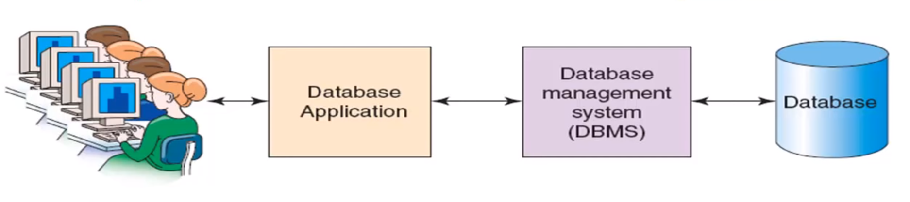

# Introduction

## 1. Purpose
   1. Store data
   2. Organizational structure data
   3. Query, creating, modfifying, delete
   4. Can store information and relationship that more complicated than list
## 2. List problem:
    1. Reduncdancy
    2. Multiple theme
    3. Modification Issues: (Anomalies)
       1. Delete
       2. Update
## 3. Relational Database
    - Store data in table:
      - Columns represent different attributes
      - Row represent an instance of entity
    - Break-up a list in to several part (each part has unique theme)
    - tables are joimed together using matched pairs of datavalue
## 4. List vs Relational Database
  
|  List | Relational Database  |
|---|---|
| Simple  | More Complicate  |
| Redundancy  | minimize data redundancy |
|  No UI | UI  |

## 5. SQL

- An international standard lanuafe for creating, procesing, and querying database

## 6. Database System

 - User
 - Application(s) (website)
 - DBMS (Database management System) as **gatekeepers**
 - Database
## 7. User
- Use a database application to keep track of information
- use different UI form to enter, read, delete, query data
- Produce report

## 8.Database
- A self-describing collection of related records
- Self-describing:
  - contains the definition of its structure
  - Metadata are data describing the structure of the data in database
- Tables with in realtional database are realted to another someway

- Database contains:
  - User data
  - Metadata
  - Indexes and other overhead data
  - Application metadate

## 9. DBMS
- gatekeepers
- control database activities
- creates, processes and administers the database its controls

## Function:
- Create databases
- Create tables
- creating supporting structures
- Read database data
- Modify data
- Maintain database strctures
- enforce rule
- control concurrency
- security
- backup and recorvery