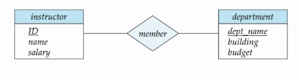

## Introduction

### Definition

Data : một dữ kiện đã biết, có thể ghi lại, ngầm định một ý nghĩa nào đó

Database: Tập hợp dữ liệu có liên quan với nhau

Metadata: Dùng để định nghĩa cấu trúc dữ liệu

DBMS: Dữ liệu + Hệ quản trị CSDL + Ứng dụng

Datamodel: 

## Relational Model 
Table / Relation
Column/ Attribute
Row/ Tuple (bộ) / Record (Bảng ghi)

Tập hợp những dữ liệu có liên quan đến nhau

Biểu diễn bằng các bảng

## Entity- Relation Model 

Tập hợp những thực thể có thuộc tính giống nhau => Tập thực thể
Các mỗi quan hệ 

